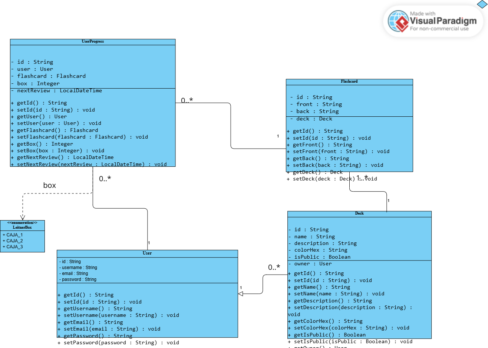

### 1 Vista de contexto

---

### 2 Vista funcional (diagrama de componentes)
.png)

---

### 3 Modelo conceptual de clases

---

### 4 Vista de implementación/desarrollo (diagrama de clases por capas)

---

### 5 Vista de despliegue
.png)
