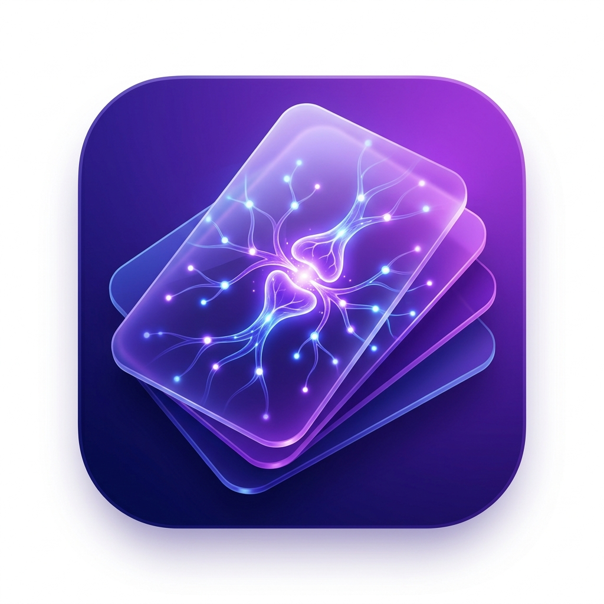

# Synap - Plataforma de Repaso Espaciado

  

Synap es una plataforma inteligente de flashcards que implementa el método Leitner para optimizar el aprendizaje mediante la técnica de repetición espaciada.

## Arquitectura y Diseño del Sistema

A continuación se presenta la documentación arquitectónica del proyecto a través de 5 vistas clave que detallan el diseño de la plataforma.

### 1. Vista de Contexto

**Descripción:** Muestra las interacciones de alto nivel entre el usuario principal (Estudiante) y los diferentes sistemas externos de los que depende la aplicación.

**Explicación:** El estudiante interactúa con la plataforma Synap a través de peticiones HTTPS/REST. Synap se apoya en tres servicios externos clave: **MongoDB Atlas** para el almacenamiento de datos NoSQL en la nube, **Brevo** como servidor SMTP para el envío de correos de recordatorios de repaso, y **Google Fonts CDN** para la carga de las tipografías modernas (como la fuente Outfit) utilizadas en la interfaz web.

---

### 2. Vista Funcional (Diagrama de Componentes)

**Descripción:** Detalla los subsistemas (Frontend y Backend) y cómo interactúan estructuralmente los componentes internos a través de interfaces.

**Explicación:** El **Frontend** está modelado con una UI de Estudio y un App Controller (Vanilla JS) que consume los endpoints REST. En el **Backend (Spring Boot 3)**, el `FlashcardController` expone la API y las peticiones pasan a través de una configuración de seguridad (`CorsConfig`). La lógica central o "cerebro" del repaso espaciado reside en el componente `LeitnerService`, el cual requiere de repositorios de datos (`UserProgressRepository`, `FlashcardRepository`) para persistir la información. Finalmente, `EmailService` actúa como un componente conector hacia el API externa de Brevo.

---

### 3. Modelo Conceptual de Clases

**Descripción:** Proporciona la vista estática microscópica del sistema, definiendo clases exactas, atributos, métodos, relaciones, cardinalidad y tipos de datos.

**Explicación:** El modelo muestra entidades clave y cómo se relacionan: un Usuario (`User`) posee varios Mazos (`Deck`), y un Mazo se compone de múltiples Tarjetas (`Flashcard`). El seguimiento individual de aprendizaje se da gracias a la entidad `UserProgress`, que rastrea el nivel de la caja (`box`) actual de la tarjeta y programa dinámicamente la próxima fecha de repaso (`nextReview`) según la dificultad elegida (representada por el Enum `DIFFICULTY`: *EASY, GOOD, HARD*). También refleja la existencia de objetos de transferencia de datos (DTOs) que transportan peticiones seguras desde el Controlador hasta los Servicios sin exponer el modelo de base de datos directamente.

---

### 4. Vista de Implementación / Desarrollo (Diagrama de Clases por Capas)

**Descripción:** Muestra la organización lógica del código fuente en el backend, evidenciando una separación limpia y estructurada mediante el patrón de Capas MVC/Service.

**Explicación:** Se aprecia una separación de responsabilidades estricta:
*   **Controller:** Encargado de enrutar las peticiones HTTP (Ej. `FlashcardController`).
*   **Service:** Donde viven todas las reglas de negocio (Ej. `LeitnerService`, `EmailService`).
*   **Repository:** Interfaces responsables del acceso a datos mediante Spring Data MongoDB.
*   **Modelo:** Las entidades nucleares de negocio (`User`, `Deck`, `Flashcard`, `UserProgress`).
Esta modularización permite que la aplicación sea altamente mantenible y fácil de probar o escalar.

---

### 5. Vista de Despliegue

**Descripción:** Ilustra la arquitectura física del sistema y los nodos (servidores y dispositivos) donde se ejecutan los diferentes artefactos de software.

**Explicación:** El frontend (archivos estáticos `index.html`, `style.css`, `app.js`) se ejecuta directamente en el **Computador del Estudiante (Navegador Web)**. Este cliente se comunica vía HTTP con el entorno de producción alojado en **Railway**, el cual ejecuta una **JVM con Java 17** corriendo el empaquetado del backend (`flashcards-SNAPSHOT.jar`). A su vez, el servidor de Spring Boot mantiene conexiones persistentes (Protocolo MongoDB) con el clúster de **MongoDB Atlas** para leer y escribir datos, y se comunica por SMTP con el **Servidor de Brevo** para despachar correos.
